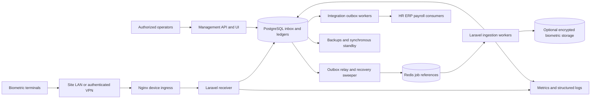
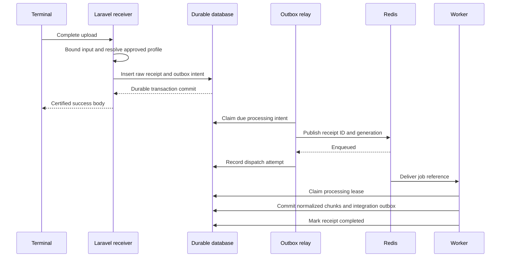
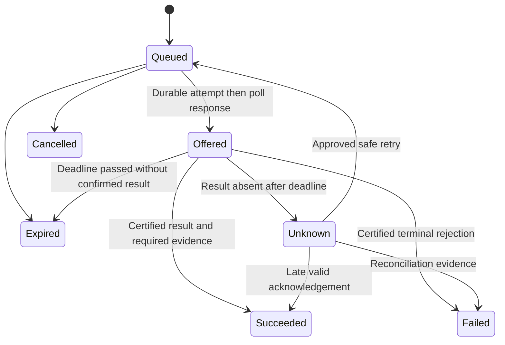

# ADMS Gateway — Software Architecture Document and Implementation Roadmap

**Product:** Laravel ADMS Bridge  
**Document version:** 1.0  
**Date:** 5 October 2026  
**Status:** Proposed architecture; implementation and hardware certification pending  
**Audience:** Engineering, infrastructure, security, operations, QA, and system owners

## 1. Architecture decision and executive overview

Build a Linux-hosted Laravel service that receives device-initiated iClock requests, durably records their raw contents, acknowledges accepted uploads, and asynchronously normalizes attendance and device events. Use Redis and Laravel workers for processing, with a database inbox and transactional outbox as the recovery authority. Persist remote commands independently of the queue; deliver them when the terminal polls and track device-reported results separately from HTTP delivery.

The recommended baseline is:

- Nginx as the restricted device-facing HTTP/TLS edge.
- Laravel with a dedicated, sessionless iClock route group and thin controllers.
- PostgreSQL as the durable inbox, normalized event store, command ledger, and outbox.
- Redis as a bounded dispatch and coordination service, carrying identifiers rather than biometric payloads.
- Supervised Laravel queue workers, an outbox relay, and recovery sweepers.
- A separate management interface and versioned integration API, sharing domain services but isolated from device request capacity.

The crucial invariant is **success is returned only after the complete upload and its processing intent have committed to the configured durable store**. Async processing begins after acceptance; durability does not. A Redis-only enqueue followed by `OK` cannot establish zero acknowledged-data loss with ordinary persistence and failover settings.

This document specifies a replacement for BioTime's device communication layer. A complete replacement of BioTime's scheduling, attendance calculation, payroll, leave, employee self-service, and reporting functions requires separate scope and acceptance criteria. These functions must remain in another system or be explicitly implemented before BioTime is retired.

### 1.1 Repository baseline and version decision

Inspection of this workspace found PHP 8.5, Laravel **13.34.0**, Filament **5.9.0**, Livewire **4.4.7**, Pest **5.3.0**, and Boost **2.10.1**. The configured development database is SQLite; the default queue configuration is the database driver. The inspected application contains starter routes and no implemented iClock receiver. Neither Octane nor Horizon is listed among direct dependencies.

The requested Laravel 11/12 architecture is achievable using the same overall boundaries, but implementation in this repository should use its installed Laravel 13 APIs. Do not downgrade dependencies to match the original brief. As of this document date, Laravel 11 is outside security support; Laravel 12 receives security fixes until 24 February 2027. If a separate Laravel 12 deployment is mandatory, pin compatible dependencies and plan its upgrade before that date. [Laravel support policy](https://laravel.com/docs/12.x/releases).

PostgreSQL, Redis, process supervision, and any additional PHP extensions/packages are proposed deployment prerequisites, not changes already made to this workspace. Select and pin supported versions in Phase 0. Dependency additions require the project's normal approval process. No runtime application code or dependencies are changed by this document.

### 1.2 Interpretation of the four headline requirements

| Requirement | Production interpretation | Boundary or tradeoff |
| --- | --- | --- |
| Sub-20ms response | Target p99 below 20ms from the edge receiving the final request-body byte to completing the response, for the certified small-upload workload | Internet latency, TLS setup, slow uploads, and large biometric bodies are measured separately; an absolute deadline during every failure is impossible |
| Async Redis ingestion | Raw upload accepted synchronously; parsing, enrichment, persistence of normalized events, and integrations run in workers | Redis is a recoverable delivery mechanism, not the sole copy of accepted data |
| Zero data loss | No loss of acknowledged uploads under a stated, tested fault model; at-least-once transport with idempotent materialization | Terminal overwrites before delivery, destruction of every durable replica, and unidentifiable repeated events remain outside the guarantee |
| Under 200MB RAM | A proposed receiver deployment budget below 200MiB, with database, Redis, management UI, and monitoring hosted separately | Whole-stack HA below 200MB is not a credible unconditional target; measured cgroup memory decides compliance |

If the business means 200 decimal MB, the limit is approximately 190.7MiB. Confirm the unit and process boundary before making it a contractual acceptance criterion.

## 2. Scope, actors, and constraints

### 2.1 In scope

1. Enroll and approve supported terminals; identify their firmware and protocol profile.
2. Respond to initialization/options requests and preserve upload cursors.
3. Receive `ATTLOG`, supported operation/personnel/verification events, state reports, and optional biometric artifacts.
4. Track heartbeat and command-poll activity without mistaking it for proof that the sensor or door is healthy.
5. Deliver approved commands through `/iclock/getrequest` and receive their reported results.
6. Normalize punches with race-safe idempotency and immutable provenance.
7. Export events through a versioned API, signed webhooks, or controlled batch exports.
8. Provide inventory, backlog, quarantine, reconciliation, command, and audit visibility.
9. Support replay, disaster recovery, and a staged migration from BioTime.

### 2.2 Explicitly separate capabilities

- Attendance and access-control PUSH dialects are separate compatibility profiles.
- Biometric verification **events** are separate from biometric templates, images, and server-side biometric matching.
- The default product records device-reported verification results. It does not compare fingerprints or faces.
- User synchronization does not imply portable fingerprint/face templates across device algorithms.
- Local access decisions and emergency door behavior remain device/controller responsibilities. Polling is unsuitable for a guaranteed immediate safety-critical unlock.
- UDP/TCP SDK polling, typically associated with a separate legacy device integration, is outside this HTTP push receiver.
- A BioTime-compatible REST API, database schema, or UI is not implied by implementing iClock routes.

ZKTeco publishes PUSH SDK as an integration family. Its device documentation also distinguishes access-control PUSH from time-attendance PUSH, including devices supporting conversion. Therefore, model/firmware support must be certified rather than inferred from the ZKTeco or OEM brand alone. [PUSH SDK](https://www.zkteco.com/en/PUSHSDK), [SC800 vendor datasheet](https://zkteco.eu/sites/default/files/content/downloads/sc800_datasheet_zkteco_europe_1.pdf).

### 2.3 Actors and trust boundaries

| Actor | Responsibilities | Trust treatment |
| --- | --- | --- |
| Terminal | Upload buffered data, poll, execute supported commands | Untrusted client; serial number is an identifier, not a credential |
| Site network administrator | Configure routing, VPN, DNS, terminal server settings | Privileged deployment role |
| Gateway operator | Register devices, investigate failures, request permitted commands | Authenticated and audited; tenant/site scoped |
| HR/personnel system | Own employee identity and desired enrollment | Authoritative for employee records, not raw device history |
| Integration consumer | Process normalized events | Authenticated client with idempotent consumption |
| Infrastructure operator | Maintain runtime, durable storage, backup, recovery | Access segregated from attendance and biometric administration |

Device ingress, management ingress, database/Redis networks, biometric storage, and outbound integration destinations are separate trust boundaries. Tenant assignment is derived from an approved device registration and ingress identity, never from a device-supplied tenant field.

## 3. Requirements and service objectives

### 3.1 Proposed measurable objectives

These are engineering acceptance targets, not benchmark results.

| ID | Objective | Acceptance condition |
| --- | --- | --- |
| NFR-01 | Fast durable upload acceptance | p99 <20ms for approved upload envelope at rated concurrency; report p50/p95/p99 and errors |
| NFR-02 | Preserve accepted bytes | Every completed success response corresponds to a recoverable committed receipt |
| NFR-03 | Idempotent attendance storage | Concurrent replay cannot create multiple normalized events for one stable event identity |
| NFR-04 | Event availability | Proposed p99 normalization lag <5s during normal rated load |
| NFR-05 | Availability | Proposed 99.9% monthly durable-ingress availability; measure dependency failures as failures |
| NFR-06 | Resource use | Receiver cgroup <200MiB at rated steady state and during certified bursts, including worker/edge processes if colocated |
| NFR-07 | Recovery | Proposed service RTO ≤30min; acknowledged RPO 0 within certified storage fault model |
| NFR-08 | Command accountability | Every issued command has an immutable actor, authorization, wire representation, and attempt history |
| NFR-09 | Isolation | No cross-tenant reads, event associations, command delivery, exports, or biometric access |
| NFR-10 | Replayability | Versioned parsers can reprocess retained raw uploads without reissuing physical commands |

The p99 target permits tail requests above 20ms. Report p99.9 and maximum as diagnostics. Do not meet the percentile by excluding rejected requests: publish success/error ratios and latency histograms together. A device-fleet outage from gateway dependency failures counts against availability even if the proxy remains up.

### 3.2 Durability levels

| Deployment level | Success barrier | Tested guarantee | Cost |
| --- | --- | --- | --- |
| D1: single durable primary | Database transaction committed with durable WAL flush | Process/OS crash recovery when the disk remains intact | Smallest infrastructure; disk/node loss exceeds guarantee |
| D2: replicated durable primary | Commit acknowledged by a synchronous durable standby in another failure domain | Loss of the primary node with controlled failover and surviving standby | Additional network and storage latency; recommended enterprise minimum |
| D3: regional disaster coverage | Explicit cross-region durable acceptance or another independently durable journal | Stated regional failure scenario | May conflict with 20ms; independent budget and availability design required |

For PostgreSQL, leave `fsync` and `full_page_writes` enabled. `synchronous_commit=on` provides a local flush and, when synchronous standbys are configured, waits for their durable WAL flush. An asynchronous standby or ordinary backup does not establish RPO 0 on primary loss. Failover must fence the old primary and promote only an eligible durable standby. [PostgreSQL WAL configuration](https://www.postgresql.org/docs/current/runtime-config-wal.html).

No deployment can promise unconditional zero loss under destruction of all storage, compromise of every copy, or corruption outside its fault model. Device buffer exhaustion during an outage must also be quantified per model.

## 4. System architecture

### 4.1 Container and deployment view



Terminals initiate every device-protocol exchange. Redis accelerates processing, while PostgreSQL retains accepted requests and recoverable work. Operators and business integrations use distinct authenticated interfaces. The diagram is a logical view: replicas and failover controllers are added according to the selected durability level.

### 4.2 Domain components

| Component | Responsibility | Must avoid |
| --- | --- | --- |
| Device identity resolver | Map approved ingress identity plus SN to tenant/device | Auto-trusting arbitrary SNs or mutable claimed metadata |
| Protocol profile registry | Select codecs, cursor rules, response shape, command capabilities | Guessing dialect from one field or global mutable defaults |
| Receipt acceptance service | Bound input; durably record bytes and processing intent | Parsing all attendance rows, integrations, synchronous queue dependency |
| Raw upload repository | Immutable bytes, metadata, checksums, retention | Treating logs or Redis as the archive |
| Outbox relay | Publish identifiers with retry and replay | Delete-before-publish or equating enqueue with completion |
| Upload processor | Parse and materialize bounded chunks idempotently | Whole-file arrays, unbounded transactions, silently discarding invalid rows |
| Attendance identity service | Produce versioned stable event identities | Deduplication by worker lock or arrival time |
| Device-state service | Update last-seen/state observations | Inferring sensor health from HTTP reachability |
| Command service and codec | Authorize, serialize, lease, correlate acknowledgements | Arbitrary wire-command injection and blind physical retries |
| Enrollment orchestrator | Reconcile desired users/templates against reported device state | Global broadcast of incompatible biometric formats |
| Integration publisher | Deliver signed, versioned events from an outbox | Performing business HTTP calls before terminal acknowledgement |
| Audit/reconciliation service | Preserve decisions, compare device/gateway/downstream records | Updating raw history to conceal discrepancies |

Keep controllers thin and use focused injected services for these boundaries. Eloquent is appropriate for management CRUD; the high-volume path should use bounded query-builder operations and explicit transactions. Introduce interfaces where they isolate a real external boundary or firmware codec, not for every class.

### 4.3 Deployment profiles

**Profile A — compact pilot:** one supervised receiver instance, one ingestion worker, one relay process, external PostgreSQL and Redis. PHP-FPM with OPcache is the initial runtime. Availability is limited by the single application node, but accepted data survives an application restart through the external database.

**Profile B — enterprise:** two or more receiver instances behind a load balancer, ingestion and integration worker pools separated, synchronous database standby, recoverable Redis failover, and independent management capacity. Each receiver is stateless with respect to accepted uploads and commands. An instance may need bounded cached device/profile metadata, but never authoritative in-memory command state.

**Profile C — disconnected sites:** keep terminal buffering as the first option. Add a site-local gateway only if outage duration, device buffer limits, or network quality require it. Give local and central receipts separate identities and an explicit forwarding protocol. This is additional scope with its own durable journal and reconciliation; a local HTTP proxy alone provides no store-and-forward guarantee.

## 5. Device protocol and compatibility contract

### 5.1 Evidence policy

The iClock endpoint family in this brief is the starting contract. Older vendor-authored PUSH SDK documents describe plain-text exchanges, attendance uploads, polling, command results, and upload stamps. However, the public official SDK listing does not expose a complete universal contract for current OEM firmware. A publicly indexed copy of the older document is a historical reference, not current certification. [Vendor-authored PUSH SDK Communication Protocol v2.0.1, mirrored copy](https://www.scribd.com/document/695654988/PUSH-SDK-Communication-Protocol-V2-0-1).

**Every wire example below is an illustrative candidate fixture.** Confirm method, field order, encoding, response terminators, success grammar, and command syntax against the actual vendor SDK for the targeted firmware and captured physical-device traffic. Do not deploy guessed open-door syntax. Retain a sanitized capture and test result for every supported profile.

### 5.2 Compatibility matrix

Maintain one row per `(manufacturer/OEM, model, firmware build, PUSH version, operating mode)` with:

- Attendance or access-control protocol family; required auxiliary endpoints.
- Supported paths, suffixes such as `.aspx` if actually observed, methods, and query fields.
- Serial-number case sensitivity, allowed byte length, and device identity evidence.
- Registration/options format, required option names, flag format, and unknown-cursor representation.
- `ATTLOG` field layout, optional fields, encoding, and verification/status code dictionaries.
- User, fingerprint, face, photo, and operation-event upload formats.
- Header behavior, HTTP version, Content-Length/chunking support, line endings, TLS and certificate validation behavior.
- Stamp semantics, reset behavior, ordered/unordered uploads, and resend behavior after rejection or lost response.
- Empty-poll response, command batch limits, wire ID range, return-code meanings, and duplicate-command behavior.
- Reboot, query, user update/delete, template transfer, and door-control support.
- Physical certification date, fixture version, known limitations, and enabled command allowlist.

Unknown devices enter a pending approval inventory with bounded diagnostics; they receive no credentials, user data, templates, or commands. Initial fleet certification should target a small named set of models instead of claiming all ZKTeco/OEM compatibility.

### 5.3 Endpoint contract

| Endpoint | Candidate method | Gateway behavior |
| --- | --- | --- |
| `/iclock/cdata` | GET | Resolve approved device; return profile-specific initialization/options and durable receipt cursor state |
| `/iclock/cdata` | POST | Accept bounded raw upload; persist receipt plus intent; return profile-specific success only after commit |
| `/iclock/getrequest` | GET | Record liveness; atomically select eligible commands; return bounded plain-text commands or certified empty response |
| `/iclock/devicecmd` | POST; other methods only if certified | Durably accept result bytes; correlate to issued command attempts; return profile-specific success |
| `/iclock/ping` | Profile-specific | Optional liveness route, enabled only when required |
| `/iclock/registry`, `/iclock/push`, or OEM auxiliary route | Profile-specific | Implement only after documenting its registration/token/state semantics |

The device path has no `/api` prefix, HTML redirect, browser session, cookie-based authentication, generic JSON envelope, or interactive challenge. Use a dedicated middleware group. Disable browser CSRF requirements only for these routes; retain them for management web routes. Skip trimming/null-conversion middleware where it can alter protocol fields. Read the original body bytes rather than using form parsing as the canonical input.

### 5.4 Candidate attendance exchange

```http
POST /iclock/cdata?SN=DEVICE001&table=ATTLOG&Stamp=opaque-cursor HTTP/1.1
Content-Type: text/plain

000123\t2026-10-05 08:00:01\t0\t1\t0\t0\t0\n
```

Here `\t` and `\n` denote actual tab and newline bytes in a fixture, not literal backslash characters. A classic candidate layout is employee PIN, device-local datetime, attendance status, verification method, work code, and reserved fields. Keep the raw code values; interpretations belong to the firmware profile. PIN `000123` must remain a string.

Candidate success:

```http
HTTP/1.1 200 OK
Content-Type: text/plain; charset=utf-8
Content-Length: 2
Cache-Control: no-store

OK
```

Some profiles may require a different body, line ending, or count-bearing acknowledgement. Do not substitute `202 Accepted`, `OK: n`, JSON, or a newline unless certified. Logical acknowledgement means the gateway has custody of the bytes; it does not prove the terminal has physically deleted its records or that every business row was normalized.

### 5.5 Candidate initialization and command fixtures

Candidate initialization fields might include:

```text
GET OPTION FROM: DEVICE001
ATTLOGStamp=<durably accepted cursor or certified unknown value>
OPERLOGStamp=<durably accepted cursor or certified unknown value>
ErrorDelay=60
Delay=30
Realtime=1
Encrypt=0
```

Option names, units, required flags, and cursor values must come from the profile. Do not use wall-clock time as an invented stamp, assume a stamp is a Unix timestamp, or globally set a high stamp that may suppress unsent records. `Encrypt=0` in a legacy dialect is not a TLS security setting.

Candidate command response:

```text
C:1042:REBOOT
```

Candidate command result body:

```text
ID=1042&Return=0&CMD=REBOOT
```

These demonstrate correlation only. Parse the certified format, including multiple-result delimiters if present; split key/value pairs once and avoid blind URL decoding of opaque data. `Return=0` is not universally equivalent to observed physical success. A command acknowledgement and a subsequent user/query upload are different events.

### 5.6 Raw payload handling and parser rules

1. Validate endpoint, method, approved identity, table identifier, Content-Encoding, and byte limits before acceptance.
2. Stream and count bytes; do not trust Content-Length alone. Reject truncated bodies and cap expanded size if compressed bodies are supported.
3. Preserve original bytes and a SHA-256 integrity checksum. Record only allowlisted metadata; headers may contain secrets.
4. Select a pinned profile/parser version. A parser upgrade must not silently change the interpretation of a pending receipt.
5. Parse lines incrementally, preserving field positions and empty tab fields. Do not split attendance rows on arbitrary whitespace because datetime contains a space.
6. Accept LF/CRLF according to profile; handle a permitted trailing newline. Keep meaningful spaces and leading zeros.
7. Support variable field counts only when the profile defines them. Retain unknown fields and raw codes.
8. Parse operation/user records with their own grammar; do not apply the attendance parser to key/value or binary records.
9. Keep binary photo/template formats byte-safe. Reject malformed or oversized structures without executable deserialization.
10. Persist invalid rows with line/byte offsets and error reason. Valid rows in a mixed upload may proceed after raw acceptance; mark the receipt `processed_with_errors` and alert.
11. Unsupported but approved upload types may be durably quarantined under an explicit custody policy. If their bytes cannot be retained safely, reject without success.

Acknowledging a durably quarantined upload transfers responsibility from the device to the gateway. The quarantine UI, alarms, replay process, and retention policy are therefore required production features, not optional debugging conveniences.

## 6. Durable acceptance and asynchronous ingestion

### 6.1 Acceptance sequence



The receiver does not require Redis to return a device success response. A database transaction includes the body, immutable receipt metadata, processing intent, and any applicable accepted-cursor update. Do not insert the raw body in one transaction and the processing intent in a later independent transaction.

### 6.2 Transaction and state boundaries

**Acceptance transaction:** resolve the authoritative approved device/profile, insert a receipt, insert its unique processing intent, and update the safe accepted cursor when the profile supports that operation. Commit before rendering success. Identity reads may use a short-lived cache, but destructive commands and revoked credentials require authoritative freshness. Avoid unnecessary device-row locks on every request; cursor serialization is profile-specific.

**Processing transaction:** insert a bounded set of normalized rows, row outcomes/provenance links, and integration outbox events; advance the receipt checkpoint atomically. Repeat by chunk. Finally persist completed status and counts. A crash resumes at the last durable checkpoint, and unique constraints handle replay of the last chunk.

**Command transaction:** atomically select/lease an eligible command, persist the immutable wire attempt and its dispatch disposition, then return it to the terminal. There is no distributed transaction spanning the HTTP connection and the physical terminal.

Receipt lifecycle:

```text
accepted -> processing -> processed
                       -> processed_with_errors
                       -> retry_wait -> processing
                       -> quarantined -> approved_replay -> processing
```

Track processing attempts separately from receipt state. Raw content is immutable. Reprocessing uses a new processing generation with its parser version and records why it was requested. Replay must not create a fresh external event for an already materialized punch unless the event is an explicit correction.

### 6.3 Outbox relay and Redis-loss recovery

The inbox receipt is a durable work ledger. An outbox row records when dispatch is due, claimed, attempted, and completed. Relay claims have bounded leases and fencing tokens; never hold a database transaction open across a Redis network call.

Relay behavior:

1. Claim due intents using database row locking appropriate to the selected database, with bounded batches and an indexed due-work predicate.
2. Commit the relay lease.
3. Publish `{receipt_id, processing_generation}` to Redis.
4. Record the publish result conditionally on the lease token.
5. On a crash after publish but before recording success, allow duplicate publication.
6. Keep the intent until processing reaches a durable terminal disposition.
7. A sweeper republishes unfinished receipts whose processing lease expired and whose dispatch grace period elapsed, including receipts previously marked as dispatched.

The last step closes the often-missed gap: a receipt published successfully can disappear from Redis before a worker executes it. A permanent `published=true` flag without unfinished-work reconciliation is insufficient.

During Redis recovery, increment a queue epoch or rebuild work from the durable ledger. Cap outstanding jobs and use increasing republish delays so an intentional worker pause does not generate an unbounded duplicate queue. Job claim fencing ensures multiple references cannot process the same receipt concurrently. A secondary worker can consume durable due-work directly only as a documented fallback with the same claim semantics.

Laravel's `after_commit` setting prevents a worker from observing an uncommitted row; it does not atomically couple a database commit to Redis delivery. The durable outbox and unfinished-receipt sweep remain necessary. [Laravel jobs and database transactions](https://laravel.com/docs/13.x/queues#jobs-and-database-transactions).

### 6.4 Queue design

| Queue | Payload | Priority and isolation |
| --- | --- | --- |
| `adms-ingest` | Receipt ID and generation | Reserved ingestion capacity |
| `adms-device-results` | Command-result receipt ID | Prompt ledger updates; isolated from slow integrations |
| `adms-enrollment` | Enrollment plan/step ID | Per-device pacing and ordering |
| `adms-integrations` | Integration outbox event ID | Independent workers; remote failures must not block ingestion |
| `adms-maintenance` | Bounded maintenance/reconciliation task ID | Lowest priority, rate limited |

For a small deployment, queues can share a worker only after starvation tests. Enterprise deployments reserve an ingestion worker pool. A priority list alone can starve lower-priority jobs under sustained ingress.

Initial tuning proposal: worker timeout 30s, Redis `retry_after` 60s, finite blocking interval 1–5s, and bounded parser chunks (start with 500 rows, then measure). Every job's actual timeout must remain below reservation expiry with a margin. Large template operations need their own timeout/reservation configuration. Use retry backoff with jitter for transient dependencies; quarantine permanent parse errors. Record terminal failures in durable receipt state as well as the framework's failed-job record. Supervisor shutdown grace must exceed the maximum intended job completion time. [Laravel queue timeouts and worker configuration](https://laravel.com/docs/13.x/queues).

Unique jobs and Redis locks reduce duplicate work but cannot replace database event uniqueness or processing leases. A queue worker may crash after committing business data and before acknowledging its job.

### 6.5 Backpressure and dependency failure

| Condition | Device ingress decision | Recovery action |
| --- | --- | --- |
| Redis unavailable, durable inbox healthy | Accept while reserved durable backlog capacity remains | Relay retries; sweeper reconstructs work |
| Workers stopped | Continue bounded durable acceptance | Alert on oldest receipt age; restart/drain workers |
| Database unavailable or durable commit fails | No success acknowledgement; return short failure response | Device retry behavior must be certified |
| Commit outcome unknown after connection loss | No success response; accept possible retransmission | Reconcile/retry idempotently; never assume rollback |
| Inbox disk/capacity threshold reached | Reject new uploads before exhaustion | Preserve reserve space; operator intervention |
| Poison upload | Accept only if custody/quarantine policy permits durable retention | Quarantine bytes; alarm and repair parser |
| Identity invalid or device revoked | Reject; no options containing secrets or commands | Security/inventory investigation |
| Body over certified limit | Reject with bounded error | Adjust device batching or approve a separately tested limit |

Use HTTP 503 for temporary inability to accept, and short plain-text errors where appropriate, but validate actual retry behavior for each profile. Some firmware interprets only particular status/body combinations. Never return success-shaped text in an exception handler or configure the proxy to serve a cached `OK` when upstream fails.

## 7. Storage model and idempotency

### 7.1 Logical schema

The following is a design specification, not executed migrations. Before implementation, use Boost database-schema to inspect the selected production engine and existing tables; generate migrations using Artisan and follow sibling conventions.

| Table | Principal fields | Constraints and access paths |
| --- | --- | --- |
| `devices` | ID, tenant/site, SN, ingress identity, approved profile/version, status, timezone, clock epoch, last seen, capabilities | Unique tenant/ingress identity + SN; indexes by tenant/status; commands never resolve from SN alone |
| `device_upload_cursors` | Device, table, protocol epoch, accepted cursor, processed cursor, receipt reference | Unique device/table/epoch; cursor ordering supplied by profile |
| `raw_uploads` | Receipt ID, tenant/device, table, raw bytes or durable object reference, checksum, byte count, receive time, query metadata, profile/parser version | Immutable content; indexes for device/time and unfinished processing; no globally unique body hash |
| `upload_processing_runs` | Receipt, generation, state, lease token/expiry, checkpoint, attempts, counts, parser version, error | Unique receipt/generation; indexed runnable state and expiry |
| `upload_record_outcomes` | Receipt/generation, row offset, outcome, normalized event reference, error code | Unique receipt/generation/offset; provenance for duplicates and rejects |
| `attendance_events` | Event ID, tenant/device, PIN string, raw local time, UTC candidate, timezone/offset, raw status/verification/workcode, source identity, identity version, extras | Unique tenant/device/source identity; indexes for tenant/device/time and tenant/PIN/time |
| `verification_events` | Device, reported identity/result/method, raw event code, event time, attendance association if proven | Independent events; indexed source identity; do not fabricate attendance from every verification |
| `device_observations` | Device, observation type, receive time, reported state, receipt reference | Bounded history; device/time index |
| `device_commands` | Internal ID, device, actor, type, typed arguments, risk/retry policy, expiry, idempotency key, state | Unique device/API idempotency key; eligible state/not-before/expiry index |
| `command_attempts` | Command, wire ID/epoch, immutable payload hash/reference, lease/fencing token, offered time, ack time/raw result, outcome | Unique device/wire ID/epoch; indexed active attempt; no cross-device correlation |
| `enrollment_plans` / `enrollment_steps` | Desired-state revision, device, subject, dependencies, verification status | Unique desired revision/device/subject; step ordering and reconciliation |
| `outbox_events` | Event ID, category, aggregate/receipt ID, generation, due time, lease, dispatch attempts, completion | Unique semantic event identity; indexes by category/due time/state |
| `integration_deliveries` | Event, destination, attempts, next retry, status/response code, last error | Unique event/destination; due delivery index |
| `biometric_artifacts` | Subject/device, modality, vendor/algorithm/version, encrypted object reference, hash, key ID, retention | Strict access control and tenant scope; compatible format lookup |
| `audit_events` | Actor/device, action, target, receive time, request/correlation ID, bounded metadata | Append-only policy; export and privileged-action access paths |

Keep tenant keys in relationships and constraints where feasible; authorization scopes alone are insufficient. Do not cascade-delete raw attendance/audit history when a device or employee is removed. Use a retirement/tombstone policy and explicit retention workflow. Separate raw payloads from indexed processing metadata so queue scans do not read large blobs.

### 7.2 Three different identities

**Receipt identity:** a unique server receipt ID for each complete HTTP upload. A retry may create another receipt; that is acceptable evidence, not another attendance event. The raw body hash is an integrity check and possible optimization hint, not proof that a later identical request is a replay.

**Record identity:** the device's stable transaction sequence/event ID if available, scoped by device and a documented sequence/reset epoch. Preserve the source ID in its original form. If a native ID is stable across restarts, do not add a new epoch just because the server or terminal reboots.

**Business identity:** the HR/personnel subject associated with the device PIN over an effective date range. This association can change while the original event remains immutable. Employee IDs, serial numbers, PINs, card numbers, and wire command IDs are distinct identifiers.

### 7.3 Punch uniqueness algorithm

Prefer a certified source key:

```text
identity = canonical(device_id, source_sequence_namespace, stable_source_event_id)
```

When the profile exposes no reliable source event ID, use a documented fallback:

```text
identity = SHA256(canonical_encoding(
    identity_version,
    device_id,
    PIN_as_string,
    original_local_datetime,
    original_attendance_status,
    original_verification_method,
    original_work_code,
    identity_relevant_reserved_fields
))
```

Canonical encoding must be unambiguous: length-prefix fields or use a deterministic ordered encoding with fixed types. Store the components, not only the hash. Use a database unique constraint to arbitrate concurrent inserts. In PostgreSQL, handle only the intended identity conflict, then read/link the existing event; do not broadly suppress unrelated data/type/constraint errors.

Do not include server receipt time, upload stamp, queue job ID, or chunk index in the attendance identity. Those values can change on retransmission. Do not deduplicate solely on `(PIN, timestamp)` because different devices, status codes, and verification modes can legitimately share that pair. Do not deduplicate across devices unless downstream business rules explicitly do so while preserving both observations.

**Information limit:** two physically distinct punches with exactly identical transmitted fields and no source sequence cannot be reliably distinguished from a resend. A hash does not solve that ambiguity. Preserve every receipt/provenance link, document the fallback collision policy, and require native IDs for an exact event-count guarantee. Parser upgrades must preserve the chosen identity scheme or use an explicit migration/alias map to prevent duplicate materialization.

### 7.4 Time and ordering

- Store receive time in UTC and the original device-local datetime as transmitted.
- Store the device's effective IANA timezone and timezone configuration revision. Do not infer historical timezone from the current server timezone or IP address.
- Store a derived UTC instant only when conversion is defensible; mark missing, ambiguous DST, invalid, or suspect-clock values explicitly.
- Preserve ambiguous local times and possible UTC candidates; do not arbitrarily select a DST offset for payroll.
- Keep source ordering separate from event time and arrival order. Offline logs can arrive after newer punches.
- Estimate clock skew only from an appropriate device-time observation, not from the age of an offline punch.
- Clock correction is a separate auditable action and does not rewrite historical raw events.
- PIN reuse requires effective-dated employee mapping; unmatched events are retained for reconciliation.

### 7.5 Cursor/checkpoint semantics

Device stamps are opaque until a profile proves otherwise. Keep accepted and processed cursors separate. A stamp may advance once the associated full payload is durably accepted, even while normalization is pending; that is safe only because the gateway has recoverable custody.

When monotonic sequences and complete batches are certified, advance a contiguous safe frontier. With opaque cursors, follow documented firmware behavior and serialize uploads if needed; never apply numeric `MAX` or lexical ordering by assumption. Record cursor observations and associated receipts for resets, out-of-order requests, and parallel uploads. Unknown/reset stamps trigger a controlled reconciliation mode, not a fabricated latest timestamp. A firmware reset may require a new cursor epoch and a bounded resync.

### 7.6 Retention and archival

Define separate policies for punches, raw uploads, quarantine, command results, audit events, and biometric artifacts. Example planning values are 30–90 days for ordinary raw uploads and business-approved periods for attendance; these are not legal defaults. Quarantined/unprocessed receipts must not expire merely because a routine raw retention window elapsed. Keep replay and restore requirements compatible with erasure obligations.

Archive processed raw payloads to encrypted object storage only after verifying the durable copy and checksum, then replace the inline body with an immutable reference transactionally. Large biometric uploads may need object-first durable acceptance: complete the object write before committing its database reference, then acknowledge. Reconcile orphan objects after database failure. Never acknowledge on an unfinished multipart upload or a temporary local file.

Keep deduplication identities/tombstones for the maximum supported historical resend horizon. Purging events and their identity keys can let old device resends recreate deleted punches. Partition large tables only after measurements; in PostgreSQL, partitioning can complicate global uniqueness. Use a separate identity ledger or another reviewed constraint strategy rather than assuming a device-event unique key spans time partitions.

## 8. Remote command system

### 8.1 Command submission and authorization

Management clients submit typed commands to a versioned authenticated API. Validate actor permission, tenant/site/device ownership, approved device capability, typed argument bounds, expiry, and an API idempotency key. Persist the command and audit event atomically. Return a command resource indicating queued state; do not report terminal execution success at submission time.

Allowlisted command types include read-only status/query, user synchronization, reboot, and certified door control. Raw command text is disabled by default. Command codecs reject embedded newline/tab/control characters in text fields unless that field's grammar explicitly permits them. User PIN/name/card values cannot inject another wire command.

A cached authorization decision is insufficient for high-impact commands. At delivery, recheck command expiry, cancellation, device approval, and relevant policy revocation. Operators need a distinct ability to open a particular door; enrollment administrators should not automatically gain it. Approval requirements, if the organization adopts them, are enforced before the command becomes eligible for polling.

### 8.2 Command state and delivery ledger



`Offered` means the gateway committed an attempt and tried to return its bytes. It does not prove the terminal received them. Record transport disposition separately from device-reported execution result and observed physical state. Cancellation after offering cannot reliably retract a command already received; expose this to operators.

Internal command IDs can be UUIDs, but wire IDs follow the firmware's numeric/string range. Persist a per-device wire ID allocator and namespace/epoch. Avoid reuse while old acknowledgements can arrive; define wraparound and retirement before reaching the firmware limit. If acknowledgements carry no epoch, a server-only epoch cannot disambiguate reused IDs, so defer reuse for a verified safety window or prevent it altogether within the device lifecycle.

### 8.3 Atomic polling

For each poll:

1. Resolve the approved device from authenticated ingress context.
2. Update bounded liveness state or a durable observation as required.
3. Lock/claim eligible commands atomically with database leases and fencing tokens.
4. Exclude cancelled, expired, unsupported, dependency-blocked, or policy-revoked commands.
5. Persist the exact wire payload and wire ID before returning it.
6. Commit; return a bounded command batch or the certified empty response.

Only one active command/batch per device is the initial safe policy. Multiple concurrent polls must not independently offer the same new command. Use database authority for claims; a Redis list pop or expiring cache lock is insufficient. During database failure, return no command and no fabricated durable acknowledgement. Idle polling still requires an availability plan; an unsafe cached command response must never be served.

### 8.4 Retry policies and the physical side-effect gap

| Command class | Default policy after lost acknowledgement | Reason |
| --- | --- | --- |
| Read-only query | Bounded retry | Repeated reads are usually safe; verify profile behavior |
| Desired-state user upsert | Reconcile then retry when idempotent for that profile | Reapplication may be safe, but template replacement or partial updates need care |
| Reboot | Mark unknown; require policy-controlled retry | A successful reboot can interrupt its own acknowledgement and repeated rebooting can cause an outage |
| Open door | No automatic replay after an offer | Repeating a physical action can be unsafe or extend access unexpectedly |
| Clear logs/delete enrollment | Disabled until explicitly scoped, authorized, and certified | Irreversible loss; gateway ingestion does not require clearing logs remotely |

For open door, use a short TTL, a door/device capability mapping, typed duration bounds, actor audit, and no backlog execution after reconnect. If offered once and the response is lost, the result becomes unknown; do not secretly retry. This sacrifices guaranteed execution to avoid unintended repeated actuation. An organization can choose another risk policy only with explicit requirements and evidence of device-side deduplication.

Exactly-once command execution cannot be established with an HTTP response plus an ordinary result callback if the device has no durable command-ID deduplication. No server-side lock can close the execute-before-ack crash gap.

### 8.5 Command results

Durably store raw result bodies before success, using the same inbox mechanism as uploads. Correlate by approved device and issued wire ID, with immutable command type/attempt data. Keep duplicate, unknown, conflicting, and late acknowledgements as evidence. Unknown result IDs must not create successful commands. A result from another device must not mutate the ledger even if its wire ID matches.

The asynchronous result worker applies conditional state transitions and preserves prior results. A late result may resolve `unknown`; an expired command can have executed before expiry, so preserve timing uncertainty. A device's success code confirms only what that dialect reports. For user synchronization, require a readback/reported revision when available. For a door, physical open status requires a sensor/event association if supported.

### 8.6 User and biometric synchronization

Create a desired-state revision per subject/device. Plan dependencies: user identity first, then card/access attributes, then compatible biometric artifacts, followed by verification/readback. Each step has its own command and outcome. Resume partial plans instead of blindly restarting all enrollment.

Preserve PIN/card strings and device-specific size limits. Record template modality, vendor algorithm/version, format, finger index, and target compatibility. A face photograph is not automatically a face template. Do not broadcast a template from one OEM device to another without documented interoperability and hardware testing. Support tombstones and staged deletion; do not delete the only stored biometric copy before migration verification.

## 9. Security, privacy, and administration

### 9.1 Device identity and network controls

Serial numbers and source IPs alone do not authenticate a device. A serial can be forged; NAT can put many devices behind one address. Prefer a device-supported authenticated protocol/TLS capability when certified. Where devices cannot supply reliable credentials or validate modern TLS, place them on a restricted LAN through a site VPN with authenticated site identity and a provisioned device inventory.

The VPN authenticates the site gateway, not each terminal. Residual risks from compromised devices or hosts on that site must be acknowledged and mitigated through segmentation, switch/network controls, inventory restrictions, and command authorization. Do not invent HMAC headers or bearer tokens and assume legacy firmware will send them. Firmware-specific registration/token flows require their own reviewed profile.

Terminate supported modern TLS at the edge. Plain HTTP for legacy devices belongs only inside a documented restricted network/VPN path. Never expose a legacy cleartext receiver directly to the public internet or weaken global TLS policy for every client to accommodate one terminal. Verify certificate validation, CA trust, hostname validation, device clock behavior, and certificate rotation on physical hardware.

### 9.2 Edge hardening

- Restrict methods and exact paths; explicitly allow only certified aliases.
- Bound query length, SN length, body size, upload time, concurrent connections, and per-identity request rate.
- Use an upload burst budget separate from heartbeat/poll budgets. Accommodate legitimate outage replay without unlimited traffic.
- Do not aggregate all terminals behind a NAT address into an overly restrictive single rate limit.
- Disable caching of device responses and prohibit automatic upstream replay of non-idempotent command polls.
- Trust forwarded headers only from configured proxies; derive source identity from protected ingress metadata.
- Keep edge request-body temp files on a sized, monitored encrypted volume when buffering is enabled.
- Suppress sensitive query strings/bodies from access logs. Limit error-body size and remove debug output.
- Protect database and Redis with private networking and least-privilege credentials; Redis is never device-facing.

Bound request buffering is a latency/resource tradeoff. Benchmark with the actual Nginx configuration; buffering a full upload before PHP changes the timing boundary but still consumes edge memory/disk. Never accept slow-client latency as hidden server success.

### 9.3 Management/API controls

Use the project's existing authentication and authorization conventions where they fit. Separate roles for fleet administration, enrollment, attendance export, biometric administration, command operation, and infrastructure. Enforce tenant/site scope in policies and database lookups. Use MFA/SSO as organizational requirements dictate, short privileged sessions, rate-limited APIs, and append-only privileged-action audit.

Do not implement a public debug/tinker endpoint or disclose raw device payloads through ordinary application logs. Parameterize SQL. Treat user names, device metadata, and quarantine contents as untrusted when displaying them in the management UI. Raw binary artifacts should be downloadable only through authorized short-lived access.

### 9.4 Biometric custody

Default to collecting attendance metadata without templates or photos unless the deployment requires enrollment portability or artifacts. When enabled:

- Classify templates, photographs, credentials, and attendance as sensitive data.
- Encrypt sensitive artifacts and raw uploads containing them with managed keys; store key/version metadata and test restoration with those keys.
- Keep secrets, passwords, templates, photos, card values, and full PINs out of logs, queue payloads, metric labels, and tracing baggage.
- Apply tenant-aware access and export audits; separate encryption-key administration from ordinary support.
- Define data residency, purpose, access, deletion, retention, and backup handling with the organization's responsible teams.
- Reconcile erasure with retained raw payloads and backups; purging only normalized templates is insufficient.

This document establishes technical controls. Jurisdiction-specific retention, employee privacy, and biometric processing obligations require a separate organizational decision rather than an assumed universal retention period.

## 10. Performance, memory, and capacity engineering

### 10.1 Latency budget

Illustrative budget for a small complete upload on a healthy local network:

| Stage | Proposed p99 budget |
| --- | --- |
| Edge dispatch and request framing after final body byte | 1ms |
| Warm framework dispatch and bounded validation | 4ms |
| Identity/profile lookup | 2ms |
| Durable inbox/outbox transaction | 8ms |
| Response serialization and edge completion | 1ms |
| Contention/jitter allowance | 4ms |
| Total | 20ms |

Component percentiles do not mathematically sum to an end-to-end percentile. These are allocation targets; measure the complete request distribution. Disk fsync latency, synchronous replica RTT, database contention, provider bootstrap, and PHP scheduling are likely constraints. Durability must not be disabled to meet the budget.

Measure three clocks separately:

1. Terminal-observed time from sending a request to reading the complete response.
2. Edge end-to-end request duration including upload transfer and TLS where measurable.
3. Server acceptance time after the final body byte, with commit and framework spans.

A 1MiB upload over a 10Mbps link already requires roughly 0.84s of ideal transmission time. No Laravel optimization can make its full terminal-observed duration 20ms. Publish body-size classes and use a separate artifact SLO.

### 10.2 Runtime selection

Start with Nginx + PHP-FPM + OPcache, optimized autoloading, cached configuration/routes where compatible, debug disabled, and a small fixed worker pool. Measure actual Laravel/Filament provider boot overhead; sessionless routes do not automatically prevent every installed provider from booting.

If measured FPM latency or throughput fails acceptance, evaluate a supported long-lived Laravel runtime such as Octane after dependency approval. Benchmark both with identical durability and traffic. Long-lived runtimes require explicit tests for tenant leakage, stale configuration, retained request objects, static caches, DB transaction cleanup, and memory growth. Do not assume Octane reduces aggregate memory; master processes and multiple workers may increase it. Never block an event loop with a slow storage call without verifying runtime behavior.

An independently bootstrapped slim receiver deployable from the same domain code may be justified if management providers prevent the budget. That is an explicit packaging/architecture decision, not a casual second framework implementation. Keep protocol semantics shared and test deployments independently.

### 10.3 Memory budget

Illustrative compact receiver budget, **to be measured**:

| Process/group | Target MiB |
| --- | --- |
| Nginx and FPM master | 15 |
| One FPM request worker | 50 |
| One ingestion worker | 50 |
| One relay/recovery process | 35 |
| Shared OPcache/runtime allocation | 20 |
| Transient payloads and reserve | 20 |
| Total | 190 |

These are allocations, not observed footprints. Count cgroup `memory.current`/peak, shared pages, socket buffers, edge buffering, and relevant page cache; summing process RSS can double-count shared memory. Installed management providers may exceed these allocations. A second request/queue worker may break the compact budget. Rate capacity accordingly or host worker pools separately with an explicitly revised scope.

Laravel worker memory flags govern recycling behavior, not a strict cgroup ceiling, and PHP `memory_limit` does not measure every native/shared allocation. Use OS limits, bounded concurrency, stream parsing, capped SQL batches, and graceful recycling; an OOM kill is a tested failure mode, not routine flow control. Shared infrastructure memory and replicated storage are additional costs.

### 10.4 Fleet sizing formulas

Let:

```text
D = device count
P = mean command-poll interval in seconds
H = mean additional heartbeat interval in seconds, if independent
A = peak attendance rows per second
B = mean attendance rows per upload
U = other uploads/registrations per second
```

Then estimated request rate is:

```text
R ≈ D/P + D/H + A/B + U
```

Omit `D/H` if the poll already serves as the heartbeat. For 1,000 devices polling every 30s, polls alone average 33.3 requests/s. At 200 attendance rows/s with batches of 20, attendance adds 10 requests/s. Synchronized polling/reconnection creates much higher short bursts; an average is not a capacity guarantee. Poll jitter should be used only if the firmware/profile supports it.

With mean service time `S`, approximate active requests as `R × S` under stable load. A synchronous request worker at 10ms has an ideal ceiling near 100 requests/s before contention and utilization margin; do not size at that ceiling. Establish rated capacity with measured CPU, I/O, memory, and tail latency. Increase workers/instances only within the declared memory and database-connection budgets.

Daily raw storage:

```text
raw_bytes ≈ daily_records × mean_record_bytes
          + upload_count × receipt_metadata_bytes
          + photos/templates
```

Add normalized rows, indexes, WAL, replication, quarantine, backups, and archive overhead from real samples. At one million 120-byte rows/day, raw row text alone is about 120MB/day, excluding every other cost.

### 10.5 Buffering and recovery capacity

If workers lag for duration `T`, required durable backlog capacity is approximately incoming raw-byte rate × `T`, plus metadata and safety reserve. Redis stores only IDs and should have a bounded outstanding job count. A Redis backlog of full payloads directly conflicts with a small-memory design.

For a terminal with `C` record capacity, `O` existing records, and peak production `a` records/s, the approximate remaining outage window is `(C-O)/a`. Verify overwrite/stop behavior rather than assuming it. Alert before the fleet's shortest safe outage window.

Let ingest rate be `λ` rows/s, drain rate `μ`, and backlog `Q`. Recovery time is approximately `Q/(μ-λ)` when `μ>λ`; otherwise the backlog never drains. A 600,000-row backlog with `μ=2,000` and `λ=200` takes about 333s under ideal steady conditions. Include device retransmission limits and integration lag in the actual recovery drill.

### 10.6 Redis operational posture

Use a private authenticated Redis instance with ACLs, bounded queue-reference backlog, and an eviction policy that cannot silently discard queued work (`noeviction` is a suitable baseline). Treat OOM write errors as relay failures. Cache data can use another instance or an explicitly isolated budget so it cannot evict queue data.

AOF persistence improves queue availability, but `appendfsync everysec` may lose roughly a second of writes in a disaster. `always` trades latency for stronger local durability. Ordinary replication acknowledgement does not create strong consistency or eliminate failover loss. These facts are why the database receipt ledger remains authoritative. [Redis persistence](https://redis.io/docs/latest/operate/oss_and_stack/management/persistence/), [Redis WAIT consistency limits](https://redis.io/docs/latest/commands/wait/).

## 11. Integration API and event delivery

Provide a versioned JSON API separate from iClock. Suggested resources are devices, raw receipt status, attendance events, verification events, command resources, enrollment plans, and reconciliation summaries. Use Eloquent API Resources for management/integration responses and stable cursor pagination for large exports.

An example proposed webhook envelope:

```json
{
  "schema_version": "1",
  "event_id": "gateway-event-id",
  "type": "attendance.recorded",
  "tenant_id": "tenant-id",
  "device_id": "device-id",
  "record": {
    "id": "attendance-event-id",
    "pin": "000123",
    "occurred_at_local": "2026-10-05 08:00:01",
    "occurred_at_utc": "2026-10-05T05:00:01Z",
    "timezone": "Asia/Riyadh",
    "status_code": "0",
    "verification_code": "1"
  },
  "received_at": "2026-10-05T05:00:02Z"
}
```

Fields and disclosure must match the consumer's authorization. UTC is nullable/qualified when device time cannot be resolved. A device code remains a code until its profile interprets it.

Create the integration outbox event in the same transaction as its normalized event. Deliver at least once, with stable event ID, bounded backoff/jitter, per-destination timeout, and a persistent delivery ledger. Consumers deduplicate by event ID. Sign exact request bytes with timestamp and key ID; support secret rotation and replay-window validation. Restrict operator-configured destinations to prevent SSRF, including redirects and DNS resolution to prohibited networks.

After the retry window, retain a failed delivery for manual replay. A downstream outage must not delay device acknowledgement or block attendance normalization. Provide authenticated pull/export recovery so a consumer can catch up without depending exclusively on webhooks. Define correction/version semantics for employee association or time interpretation changes; do not silently overwrite delivered history.

## 12. Observability and operational controls

### 12.1 Metrics

| Category | Metrics |
| --- | --- |
| Ingress | Requests by endpoint/profile/status, full-request and post-body latency, body bytes, rejection reason, durable commit latency |
| Durability | Database commit errors, replication health, storage free space, backup freshness, restore-drill age |
| Processing | Accepted/processed/quarantined receipts, oldest unprocessed age, row throughput, duplicate ratio, parse errors, lease expiry |
| Queue/outbox | Due age, dispatch failures, Redis OOM/write errors, reserved age, replay/sweeper count, recovery epoch |
| Fleet | Last-seen age, reconnect bursts, stale device count, cursor resets, clock-quality observations |
| Commands | Queued age, offered count, ack latency, unknown outcomes, expired/cancelled count, capability rejection |
| Integrations | Delivery lag, success/error rate, retries, dead letters, oldest outstanding event |
| Resources | Cgroup memory/peak/OOM, CPU, file descriptors, DB connection usage, disk/fsync latency |

Use bounded-cardinality metric labels: endpoint, profile, queue, result category. Put per-device diagnostics in tenant-scoped logs or management queries instead of unbounded labels. Correlate receipt ID, processing generation, event ID, internal command ID, and attempt ID; redact sensitive content.

### 12.2 Alerts and runbooks

- Page on inability to durably accept uploads, disk reserve breach, loss of configured synchronous durability, or acknowledged-receipt recovery mismatch.
- Alert on oldest unprocessed age above the objective, increasing quarantine count, repeated relay failure, and drain rate below ingress.
- Alert on a fleet-level drop in polls to distinguish site/network failure from one offline terminal.
- Treat unknown door/reboot outcomes as an operator investigation, not an automatic retry trigger.
- Track terminal buffer risk, not only server uptime.

Required runbooks: database outage/failover, Redis rebuild, worker crash/stall, backlog saturation, firmware parser failure, clock/cursor reset, command outcome unknown, restore/PITR, compromised device/site, and BioTime rollback.

### 12.3 Health probes

Liveness checks whether the process is responsive and should be restarted. Ingress readiness checks whether durable acceptance is available at the declared level and within reserve capacity. Worker health checks recent processing progress and dependency access. Integration health is separate from receiver readiness.

Redis outage need not make device ingress unready while the durable backlog remains safe. Loss of required synchronous storage does make it unready. Health responses must not leak credentials or device contents. Do not rely solely on Laravel's generic `/up` response as evidence that uploads can be acknowledged safely.

## 13. Failure analysis and recovery guarantees

| Failure point | Expected outcome | Required evidence |
| --- | --- | --- |
| Crash before receipt commit | No success response; device retains/retries according to profile | Hardware resend fixture |
| Crash after receipt commit, before response | Device may retry; original receipt remains; normalized event deduplicates | Crash test plus DB uniqueness test |
| Response received, application crashes | Receipt recoverable; relay eventually processes it | Accepted-ID reconciliation after restart |
| Redis loses all queued references | Unfinished receipts republished from database | Queue rebuild drill |
| Relay publishes then crashes | Duplicate job possible; one processing generation claims work | Lease/fencing and duplicate publication test |
| Worker crashes mid-chunk | Uncommitted chunk rolls back; committed checkpoint survives | Restart at checkpoint with provenance counts |
| Worker commits then queue ack is lost | Duplicate delivery no-ops/links existing results | Concurrent replay test |
| Primary DB node lost under D2 | Fenced failover to eligible durable standby; no acknowledged receipt missing | Real failover and receipt-list comparison |
| Synchronous replica unavailable | No downgrade to weaker durability without an explicit service-level decision | Readiness/acceptance failure test |
| Terminal uploads invalid rows | Bytes retained and rejects visible; processing disposition accurate | Mixed-validity fixture and replay |
| Command executed but result lost | Unknown physical outcome; retry policy respected | Physical command-loss test |
| Site disconnected beyond buffer limit | Potential device-origin loss outside gateway acceptance guarantee | Model capacity/overwrite test and alert |
| Full raw archive lost | Replay impossible for those receipts unless another verified copy exists | Backup/object recovery drill |

After a database restore to an older point, devices may already have forgotten acknowledged records. Ordinary PITR from an earlier backup cannot recreate those missing accepted bytes by requesting them from every device. RPO 0 for that scenario requires surviving durable copies/journal coverage through the acknowledgement frontier. Never label a periodic backup strategy as zero loss.

## 14. Testing and certification plan

### 14.1 Test layers

Use this project's Pest conventions and factories. Start with feature tests for HTTP and business contracts; use unit tests for standalone parser/identity logic. Run real PostgreSQL and Redis integration tests for transactional, lease, failover, and queue semantics. SQLite and `Queue::fake()` cannot prove these properties.

| Layer | Required cases |
| --- | --- |
| Protocol fixtures | Every certified method/path/options format, exact success/empty bodies, CRLF/LF, missing optional fields, binary framing, encodings |
| HTTP acceptance | Missing/forged identity, revoked device, invalid table, truncated/oversized body, no session redirect/CSRF failure, durable acceptance before success |
| Parser behavior | Empty fields, leading-zero PIN, datetime spaces, unknown codes, extra fields, malformed line, mixed-validity batch, bad binary length |
| Punch identity | Exact replay, concurrent replay, different-device same PIN/time, same timestamp different status/method, fallback collision policy, parser revision stability |
| Time semantics | Offline arrival, historical timezone revision, DST ambiguous/nonexistent time, skew, clock reset, unmatched/reused PIN |
| Inbox/outbox | Commit/rollback, commit outcome uncertainty, publish-record crash, Redis data loss after publish, expired worker lease, fencing, quarantine replay |
| Commands | Simultaneous polls, expiry/cancellation, wire-ID wrap/reuse, cross-device ack, duplicate/conflicting/late ack, lost response, no unsafe auto-retry |
| Enrollment | Partial plan, dependency ordering, unsupported template algorithm, retry/readback, subject/device mapping |
| Security | Tenant boundaries, each unauthorized command role, command newline injection, malicious metadata display, secret redaction, SSRF restrictions |
| Integrations | Stable event ID, signed payload, retry/failure/replay, pull catch-up, downstream deduplication, explicit correction |
| Operational | Process OOM, slow fsync, disk full, DB primary/standby failure, Redis outage, deployment drain, backup restoration |

Do not fake the queue in durability/processing tests. Use controlled clocks for leases, expiry, and retry windows; real process termination for crash tests; and distinct test databases for destructive infrastructure drills. Assert externally visible behavior and retained records, not just the presence of configuration keys.

### 14.2 Hardware laboratory

Use at least one physical terminal for each supported profile and firmware build. Obtain written/current SDK materials through the vendor as needed. Sanitized packet captures become golden fixtures; never commit actual templates, passwords, employee data, or photos into tests.

Certification scenarios:

1. Boot/register with no prior cursor; repeat registration without resetting history.
2. Produce known punches with every supported status/verification method.
3. Disconnect the network, accumulate logs, reconnect, and verify batch/retry behavior.
4. Drop the success response after commit; verify resend and deduplication.
5. Return certified failure responses; verify the terminal keeps records and retries.
6. Test maximum configured batch/body size and offline buffer exhaustion behavior.
7. Reboot during upload and during command execution; observe cursor/sequence changes.
8. Test command no-op/readback before enabling reboot; test door control only on a controlled lab rig.
9. Drop a command response or result callback; record whether firmware repeats execution.
10. Test TLS certificate chain, hostname, rotation, wrong clock, and unsupported TLS configurations.
11. Export native device records if possible and compare with every gateway event.

Do not certify a profile with unresolved upload success semantics, cursor behavior, or unsupported destructive commands. Simulator tests accelerate coverage but cannot prove physical buffering and execution behavior.

### 14.3 Load-test matrix

| Workload | Purpose | Pass criteria |
| --- | --- | --- |
| Normal mixed fleet | Attendance, options, polls, result traffic | Rated p99 acceptance <20ms, lag and resource targets met |
| Shift change | Sudden synchronized punches | No lost accepted bytes; bounded contention and published latency/errors |
| Reconnect storm | Concurrent registration/polls and historical batches | Durable capacity remains safe; fair device handling |
| Maximum certified batch | Largest routine text upload | Bounded memory and transaction size; measured size-class latency |
| Biometric artifact upload | Largest approved template/photo | Separate artifact SLO; no ingestion starvation |
| Redis down | Durable backlog growth | Accepted bytes retained; recovery without missing normalized events |
| Database slow/down | Commit timeout and retry | No success before durable commit; bounded resource consumption |
| Worker restart/OOM | Duplicate delivery and lease recovery | Correct event counts/provenance after restart |
| 24–72h soak | Memory leaks, queue growth, time/lease behavior | No unexplained monotonic memory growth; peak within declared limit |

Use an arrival-rate load model to expose saturation rather than relying only on closed-loop clients that slow down with the server. Load generation is outside the gateway resource budget. Include management load where colocated, real TLS, production provider boot, database checkpoint/backup activity, and the chosen synchronous replication settings. Publish machine specs, fixture/body distribution, concurrency, version/build hashes, and full latency/error/resource results.

### 14.4 Release invariants

- Every successful upload has retrievable accepted bytes or a verified durable artifact reference.
- Every accepted receipt has a processing run and recoverable intent.
- Every data row has a persisted, duplicate-linked, or rejected outcome; counts reconcile with parser framing.
- No normalized event violates the selected identity constraint under concurrent replay.
- Every delivered command has a precommitted immutable attempt and authorized device correlation.
- Unsafe commands are never automatically replayed after an ambiguous offer.
- Redis flush/restart cannot permanently orphan unfinished accepted uploads.
- Production-engine crash/failover tests pass within the selected durability scope.

## 15. Step-by-step implementation roadmap

Effort below assumes two experienced backend engineers, fractional operations/security support, and available hardware/vendor documentation. Ranges are planning estimates. Firmware diversity, enrollment portability, and full BioTime feature parity can materially extend them. Each phase ends with concrete reviewable evidence; progress is gated by outcomes rather than calendar dates.

### Phase 0 — Scope and architecture baseline (3–5 working days)

1. Inventory actual models, firmware builds, device counts, polling intervals, daily/peak rows, maximum batches, photos/templates, and site connectivity.
2. Map current BioTime functions and every downstream consumer; classify which remain external and which the gateway must replace.
3. Confirm resource unit/boundary, latency measurement boundary, required durability level, outage window, and recovery objectives.
4. Adopt installed Laravel 13 for this repository, or document a separately supported Laravel 12 target and upgrade plan.
5. Select pinned PostgreSQL/Redis versions and runtime/deployment topology; inspect database schema via Boost before migration design.
6. Obtain SDK materials, required licenses/permissions, test devices, and a safe door-control rig.
7. Establish tenant/site identity provisioning, role matrix, biometric collection scope, and retention decisions.

**Exit:** signed scope/compatibility inventory, fault model, rated workload hypothesis, and acceptance matrix. No blanket all-model compatibility claim.

### Phase 1 — Protocol characterization (5–10 working days per initial profile set)

1. Capture initialization, `ATTLOG`, operation uploads, command polls/results, liveness, and supported artifacts from physical terminals.
2. Record exact bytes, encoding, success/failure behavior, cursor rules, and buffer retention.
3. Create sanitized fixture datasets and a replay client for load/certification, distinct from ordinary application test coverage.
4. Define profile/codec contracts and capabilities; record unsupported modes explicitly.
5. Prove response-loss retry behavior and basic command ambiguity on hardware.

**Exit:** one or more certified initial protocol profiles and fixture-backed contracts. Door commands remain disabled until separately certified.

### Phase 2 — Durable ingestion foundation (5–8 working days)

1. Read applicable project rules; use Artisan generators for models, factories, migrations, controllers, jobs, and generic classes.
2. Add device inventory, profile versions, raw receipts, processing runs, row outcomes, and outbox schema with reviewed indexes/constraints.
3. Implement an exact `/iclock/*` middleware group without session/browser requirements; adapt `bootstrap/app.php` using installed-version documentation.
4. Implement approved identity resolution, bounded byte acceptance, short plain-text errors, and profile-specific responses.
5. Persist receipt + processing intent + safe cursor state in one transaction; acknowledge after the configured durable commit.
6. Add ingress readiness, basic metrics, body/log redaction, and storage-reserve rejection.
7. Test commit/response crash boundaries against the production database engine.

**Exit:** every successful device upload is durably recoverable, even with Redis disabled. No attendance parsing is required for acceptance.

### Phase 3 — Async normalization and idempotency (5–8 working days)

1. Implement leased outbox publication and unfinished-receipt recovery sweep.
2. Configure Redis and ingestion workers with bounded references, appropriate timeout/reservation margin, and supervised restarts.
3. Implement streaming `ATTLOG` parsing, versioned identity generation, and race-safe inserts.
4. Add row provenance, rejects/quarantine, parser generations, and bounded replay.
5. Implement original/local/UTC time handling and effective-dated subject mapping.
6. Add state/verification/operation parsers only for certified profiles; retain unsupported approved content under custody policy.
7. Create integration outbox events in normalization transactions.
8. Prove Redis loss, duplicate delivery, worker crash, and poison-row recovery.

**Exit:** accepted/processed row accounting reconciles; no duplicate normalized punches under concurrent replay; Redis is rebuildable.

### Phase 4 — Two-way command control (5–8 working days)

1. Add command, attempt, wire-ID allocator, and result receipt structures.
2. Implement typed command API, tenant/device authorization, idempotency keys, audit, TTL, and capability checks.
3. Implement atomic poll leasing with immutable wire payload persistence and concurrent-poll protection.
4. Parse result receipts; handle duplicate, conflicting, unknown, and late results.
5. Enable read-only commands, then controlled reboot, with per-command retry policies.
6. Enable door control only after lab certification, restricted authorization, short expiry, and unknown-outcome handling are demonstrated.
7. Add command-state visibility and operator reconciliation.

**Exit:** commands are auditable and device-correlated; physical retry ambiguity is visible and controlled.

### Phase 5 — Enrollment, integrations, and administration (5–10 working days)

1. Implement desired-state user plans with ordered steps and readback verification.
2. Add compatible template/photo storage and synchronization only where required and approved.
3. Implement versioned API Resources, stable export cursors, signed webhooks, delivery ledger, and manual replay.
4. Add management inventory, receipt status, quarantine review, command history, enrollment outcomes, and reconciliation views using existing project conventions.
5. Reuse the installed Filament/authorization stack where appropriate; consult its matching-version skill/docs before implementation.
6. Test cross-tenant access, command injection, SSRF, artifact access, sensitive-data redaction, and partial enrollment recovery.

**Exit:** operators can investigate and repair retained failures; downstream systems can recover independently from webhook outages.

### Phase 6 — Performance and resilience qualification (5–10 working days)

1. Deploy the proposed topology with production-like hardware and synchronous durability settings.
2. Measure full-request and post-body latency, durable commit latency, worker lag, CPU, cgroup memory, and connection budgets.
3. Tune provider bootstrap, FPM/OPcache, query/index design, worker chunks, and fairness within the memory boundary.
4. Evaluate a long-lived runtime only if baseline evidence requires it and dependency approval is obtained.
5. Run shift-change, reconnect, outage, failure, and 24–72h soak tests.
6. Drill restore/failover and prove no missing acknowledged receipt within the selected fault model.
7. Publish the supported workload envelope and separate large-artifact limits/SLOs.

**Exit:** quantified latency/memory/durability report, no unresolved critical security findings, and practiced runbooks. If targets conflict, adjust topology/capacity with evidence rather than weakening durability.

### Phase 7 — BioTime migration and cutover (5–10 working days plus observation)

1. Back up BioTime and export available personnel, device inventory, historical punches, enrollment artifacts, settings, and current command state.
2. Record serial/PIN/employee mappings, historical timezone, code interpretations, and template algorithm/version provenance.
3. Load historical records through an explicit import pipeline with source namespace and import batch IDs; do not fabricate device upload stamps.
4. Reconcile imported counts and downstream payroll/report behavior before redirecting terminals.
5. Pilot one site/profile with gateway remote commands disabled initially.
6. Compare device exports, gateway records, and downstream records over shift changes and an offline/reconnect cycle.
7. If a terminal supports only one ADMS target, shadow by controlled request mirroring or device/legacy exports; do not assume it can upload to two servers. Disable mirrored command replies and never let a shadow receiver acknowledge before the primary's durable result.
8. Cut over by site/device cohort; record the authoritative communication and employee-enrollment owner.
9. Enable supported remote commands only after stable ingestion and reconciliation.
10. Keep BioTime recoverable/read-only for the agreed validation period; retire it only after every retained business function has an owner and approval.

**Exit:** cohort counts reconcile, latency/backlog acceptable, rollback rehearsed, business consumers accepted, and no active dual command authority.

### Phase 8 — Ongoing operation

1. Patch supported dependencies and infrastructure; test against the compatibility fixtures before rollout.
2. Certify every new firmware/model rather than silently inheriting an old profile.
3. Drill queue reconstruction, database failover, archive restore, and encryption-key recovery periodically.
4. Review capacity, buffer risk, retention, role privileges, unknown command outcomes, and quarantine debt.
5. Track measured SLO/error budgets and revisit scaling before overload becomes terminal-origin data loss.

### 15.1 Proposed implementation map

Keep the Laravel directory structure. Proposed additions belong under existing framework areas; names should be checked against sibling conventions when implementing:

```text
app/Http/Controllers/      device ingress and management API controllers
app/Http/Middleware/       approved identity, protocol context, byte limits
app/Models/                device, receipt, event, command, outbox models
app/Jobs/                  receipt processing, enrollment, integration delivery
app/Console/Commands/      outbox relay, receipt recovery, reconciliation
app/Policies/              device, command, export, biometric access policies
app/Providers/             protocol/service bindings and route integration
config/                    gateway profiles, limits, retry/retention settings
database/migrations/       durable ledgers and uniqueness/index constraints
database/factories/        approved device and receipt/event test data
database/seeders/          safe development fixtures; no production identities
tests/Feature/             HTTP, tenant, persistence, command contracts
tests/Unit/                framework-independent parser and identity logic
```

A dedicated route file or new domain directory can be proposed when implementation benefits justify it; follow the repository's approval rule for new base folders. The high-throughput receiver and management UI should remain distinguishable in configuration and deployment even when sharing application code.

Use `php artisan list` and each generator's `--help` before selecting options; pass `--no-interaction`. Generate Pest feature tests with `php artisan make:test --pest Name --no-interaction` without duplicating the test suite directory in the name. Run the narrowest relevant tests after changes. For PHP edits run `vendor/bin/pint --dirty --format agent`, then the project's applicable static analysis. After feature tests pass, ask the user to run the complete suite with `php artisan test --compact`. No test execution is needed to substantiate this documentation-only change, and no implementation test pass is claimed here.

## 16. Deployment, release, and rollback procedure

### 16.1 Production setup

1. Provision network segmentation/VPN, DNS, restricted device ingress, management ingress, and private service connectivity.
2. Provision selected durable PostgreSQL level, safe failover/fencing, encrypted backups/PITR, and tested credentials/key access.
3. Provision Redis with reviewed memory/persistence/ACL settings and no public listener.
4. Deploy immutable application artifacts with pinned dependency lockfile, compatible PHP/extensions, OPcache, and production configuration.
5. Run reviewed migrations with a backward-compatible expand/contract strategy. Avoid long blocking index/schema operations during fleet peak periods.
6. Start relay/recovery and workers under one chosen supervisor (systemd or Supervisor); prevent duplicate unintended process managers.
7. Configure liveness/readiness, metrics, logs, capacity alerts, graceful shutdown, and resource limits.
8. Validate end-to-end custody using a certified physical terminal and an acknowledged-receipt recovery check before fleet enrollment.

Avoid mixing management UI load with device ingress capacity on a hard memory budget. Laravel Cloud or another managed platform is possible only after verifying raw device protocol ingress, VPN requirements, worker lifetime, durable storage, and resource accounting; deployment convenience does not prove protocol suitability.

### 16.2 Application rollout

Use backward-compatible raw/queue envelopes containing receipt ID and generation. Drain/recycle workers between releases so they load new code; preserve pending receipts and profile/parser versions. Bring new instances ready before stopping old ones. Parser changes can be enabled per profile/cohort and rolled back independently. Do not drop fields or old codecs while pending receipts still depend on them.

Readiness failure during rollout must cause a retriable failure, never a maintenance HTML page with success status. Prevent proxy/CDN routing changes from altering iClock paths or command response bodies. Do not automatically retry a GET command-poll upstream merely because GET normally appears idempotent.

### 16.3 Rollback to BioTime

Freeze creation of new physical commands, identify offered/unknown commands, and prevent a second server from reissuing them. Export gateway-accepted punches and command/enrollment outcomes before changing device targets. Restore the prior ADMS destination per cohort and reconcile already acknowledged gateway-only punches into the retained business system using supported imports/integrations.

Do not assume terminal buffers still contain gateway-acknowledged punches. Do not reset stamps or issue a destructive clear/reset as a rollback shortcut. Enrollment changes made by the gateway require their own state reconciliation. Keep one authoritative server for command control throughout rollback.

## 17. Architecture decision record and risk register

### 17.1 Decisions

| Decision | Selected approach | Rejected/conditional alternative |
| --- | --- | --- |
| Durable acceptance | Database raw inbox + outbox before success | Redis-only acknowledgement lacks the required default fault guarantee |
| Async execution | Redis references + Laravel workers + DB recovery | Post-response callbacks/deferred execution do not establish durable work |
| Event delivery | At least once with unique source identity and provenance | End-to-end exactly once cannot be promised across terminal/HTTP/worker/consumer boundaries |
| Database | Proposed PostgreSQL with explicit durability level | Existing SQLite retained for local development; production engine change is a deployment decision |
| Runtime | Benchmark FPM first | Octane conditional on evidence, compatibility, and approval |
| Device compatibility | Versioned, hardware-certified profiles | Universal brand-based parser/command assumptions |
| Remote command persistence | Durable command/attempt ledger | A destructively popped Redis command queue loses evidence and safe retry context |
| Physical command retry | Risk-specific policy; unknown outcome exposed | Blind retries cannot guarantee safe exactly-once actuation |
| Biometric processing | Device performs matching; optional encrypted artifact custody | Building a server biometric engine is separate scope |
| Product replacement | Replace device bridge, explicitly map remaining BioTime functions | Gateway ingestion alone does not reproduce an enterprise attendance product |

### 17.2 Risks and mitigation

| Risk | Impact | Mitigation / release gate |
| --- | --- | --- |
| Undocumented OEM dialect | Missing records or bad acknowledgements | Per-firmware fixtures and hardware certification |
| Source lacks unique event IDs | Identical punch ambiguity | Preserve raw evidence; document fallback policy; exact counts require stable source identity |
| Durable commit exceeds 20ms | Latency target fails | Measure disk/replica/boot overhead; scale topology; preserve durability |
| Management provider overhead | 200MB/latency target fails | Separate management capacity; benchmark slim receiver packaging |
| Legacy insecure terminal identity | Spoofing/data exfiltration/commands | Restricted site network/VPN, inventory, segregation, residual-risk ownership |
| Buffer fills during outage | Device-origin loss | Model buffer tests, backlog/network alarms, local gateway when justified |
| Lost physical-command ack | Unknown actuation or unsafe replay | Risk-specific retries and operator reconciliation |
| Cross-model template mismatch | Enrollment failure or corruption | Algorithm/version compatibility and readback |
| Hidden BioTime business dependency | Migration breaks payroll/reports | Function and consumer inventory before retirement |
| Backup/keys unusable | Failed disaster recovery | Regular full restore and key-recovery drills |
| Archive/identity purge too early | Replay impossible or duplicates reappear | Retention horizon and identity tombstones |

## 18. Production readiness checklist and definition of done

The gateway is production-ready only when all applicable items have reviewable evidence:

- Scope identifies every retained/replaced BioTime function and downstream system.
- Installed framework and deployment dependencies are pinned and supported.
- Every enabled device profile is certified on named physical firmware.
- Exact initialization, upload success, empty polling, and result response contracts are fixture-tested.
- Device rejection/timeout behavior preserves buffers under the certified failure modes.
- Accepted raw bytes, outbox intents, cursor transitions, and provenance reconcile.
- Database uniqueness survives concurrent replay and preserves distinct supported source events.
- Redis reconstruction and worker/relay crash tests recover every unfinished accepted receipt.
- Durability level, fencing, restore/failover RPO/RTO, and limits are documented and demonstrated.
- Command expiry, actor permission, device capability, and per-attempt correlation are enforced.
- Door/reboot unknown-outcome behavior is demonstrated without unsafe automatic replay.
- Enrollment formats and partial-sync/readback recovery are certified where enabled.
- Tenant boundaries, secrets, biometric access, command injection, and webhook SSRF tests pass.
- Load/soak tests publish realistic size/rate classes and meet agreed latency/memory objectives.
- Storage reserve, buffer risk, quarantine, stale work, fleet outage, and command alerts have owners.
- Backup, encryption-key restoration, and archived-byte retrieval have been tested.
- Pilot reconciliation and rollback have been rehearsed; only one command authority is active.
- Business owners approve cutover based on observed records and retained feature coverage.

## 19. References and evidence limits

1. [ZKTeco PUSH SDK product listing](https://www.zkteco.com/en/PUSHSDK) — establishes the vendor integration family; does not certify the examples in this document.
2. [ZKTeco SC800 official datasheet](https://zkteco.eu/sites/default/files/content/downloads/sc800_datasheet_zkteco_europe_1.pdf) — illustrates separate access-control and attendance push capabilities.
3. [Vendor-authored PUSH SDK Communication Protocol v2.0.1, mirrored historical document](https://www.scribd.com/document/695654988/PUSH-SDK-Communication-Protocol-V2-0-1) — historical orientation only; current exact SDK documents and hardware captures remain required.
4. [Laravel release/support policy](https://laravel.com/docs/12.x/releases) — framework/PHP support and lifecycle.
5. [Laravel 13 queues](https://laravel.com/docs/13.x/queues) — worker lifecycle, retries, timeouts, and dispatch/transaction behavior; installed-version Boost documentation was also consulted.
6. [PostgreSQL WAL configuration](https://www.postgresql.org/docs/current/runtime-config-wal.html) — durable local/standby commit semantics; select documentation matching the deployed major version before implementation.
7. [Redis persistence](https://redis.io/docs/latest/operate/oss_and_stack/management/persistence/) — AOF/RDB durability tradeoffs.
8. [Redis WAIT](https://redis.io/docs/latest/commands/wait/) — replication acknowledgement and consistency limits.

Architecture, workload allocations, entity names, implementation sequencing, and acceptance gates are engineering proposals. They are not vendor compatibility promises or measured results. The production guarantee begins only after the chosen profiles, durability level, and workload envelope pass the stated qualification gates.
